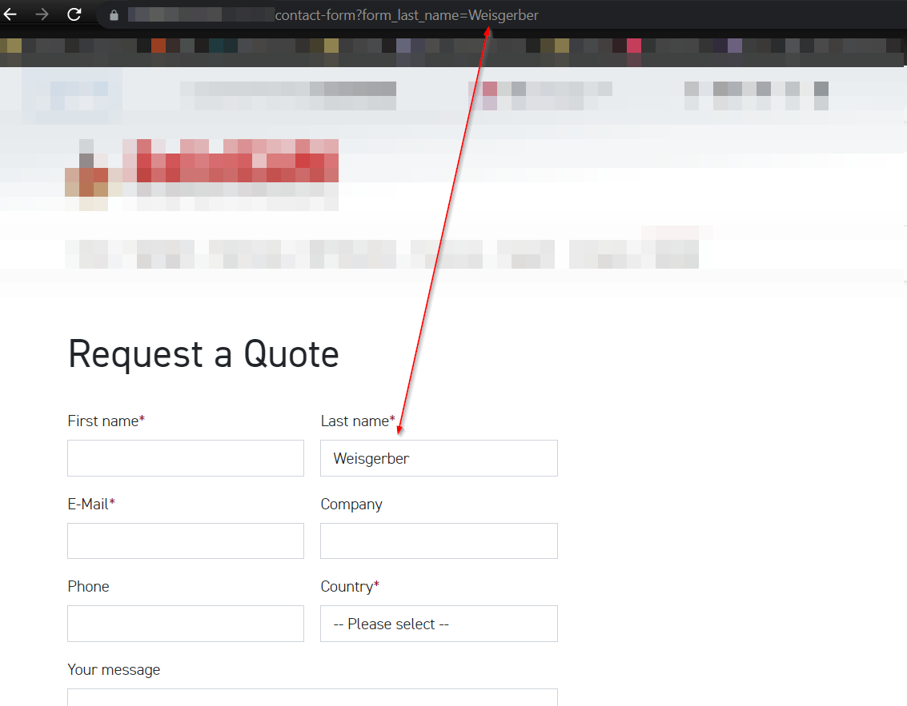

TYPO3 Extension: datamints_forms_get_prefill
============

Prefills form fields by URL GET-parameters. Works with EXT:powermail & EXT:form

Links:

- [TER](https://typo3.org/extensions/repository/view/datamints_forms_get_prefill)
- [Documentation](https://docs.typo3.org/p/datamints/forms_get_prefill/master/en-us/)
- [Contact](mailto:m.weisgerber@datamints.com)

Features:
---------

- Prefill Form Fields by defining GET-Parameters e.g. www.example.com/?form_car=Audi
- Works with EXT:form & EXT:powermail
- Sets values with javascript (vanilla without dependencies!)

Usage and installation:
---------

- Install the extension with the TYPO3 extension manager or composer
- Add the static TypoScript to your Site template
- Simply enter your field identifier with an "form"-prefix parameter, e.g. www.example.com/?form_car=Audi where "car" is your field identifier/name

Screenshots
---------

